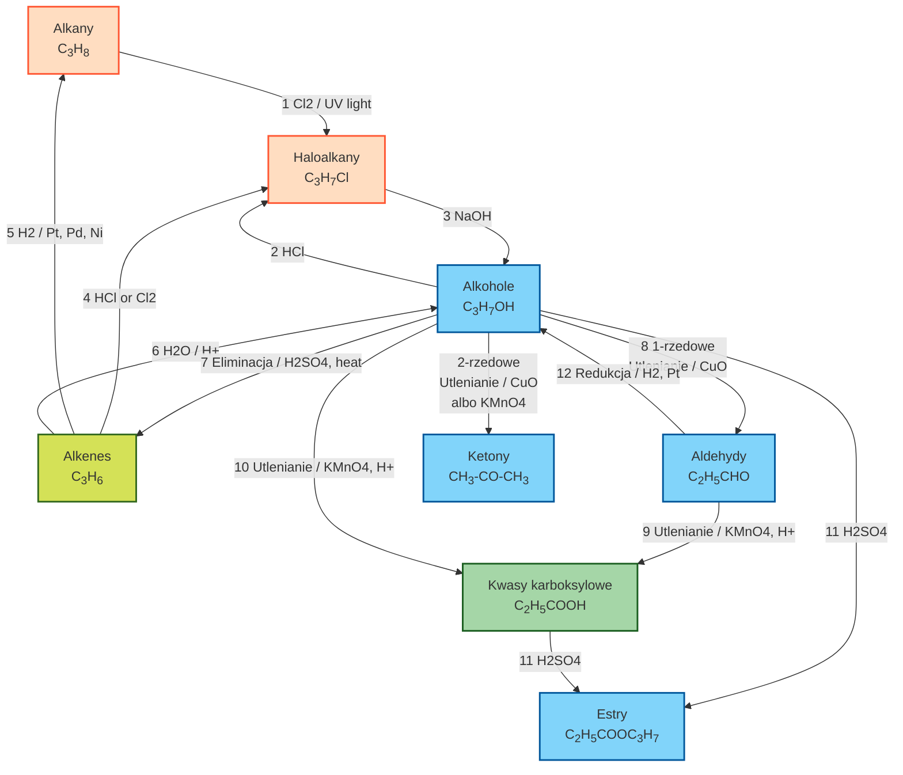
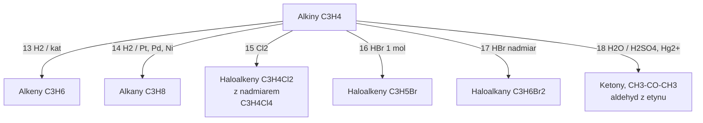
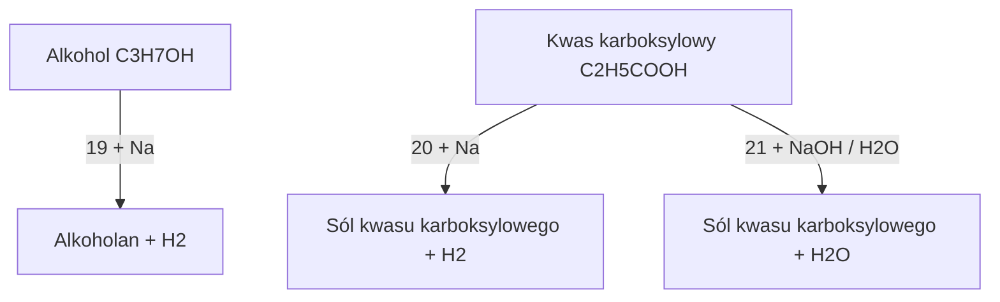

Alkiny:

Reakcje z sodem itp.

1. C₃H₈ + Cl₂ →hv→ C₃H₇Cl + HCl

1. C₃H₆ + HCl → C₃H₇Cl (patrz 4) Markownikow!

1. C₃H₇Cl + NaOH → C₃H₇OH + NaCl

1. C₃H₆ + Cl₂ → C₃H₆Cl₂ (patrz 2)

1. C₃H₆ + H₂ →kat→ C₃H₈

1. C₃H₆ + H₂O → C₃H₇OH Markownikow!

1. C₃H₇OH →Al2O3 albo H2SO4→ C₃H₆ + H₂O Zajcew!

1. C₃H₇OH + CuO → C₂H₅CHO + H₂O + Cu

1. C₂H₅CHO + [O] → C₂H₅COOH

1. C₃H₇OH + [O] → C₂H₅COOH + H₂O

1. C₂H₅COOH + C₃H₇OH → C₂H₅COOC₃H₇ + H₂O

1. C₂H₅CHO + H₂ → C₂H₅CH₂OH

1. C₃H₄ + H₂ → C₃H₆

1. C₃H₄ + 2H₂ → C₃H₈

1. C₃H₄ + Cl₂ → C₃H₄Cl₂

1. C₃H₄ + HBr → C₃H₅Br Markownikow!

1. C₃H₄ + 2HBr → C₃H₆Br₂ Markownikow!

1. C₃H₄ + H₂O → CH3-CO-CH3 Markownikow!

1. C₃H₇OH + Na → C₃H₇ONa + ½ H₂

1. C₂H₅COOH + Na → C₂H₅COONa + ½ H₂ (bezwodne środowisko)

1. C₂H₅COOH + NaOH → C₂H₅COONa + H₂O (reakcja w wodzie)
