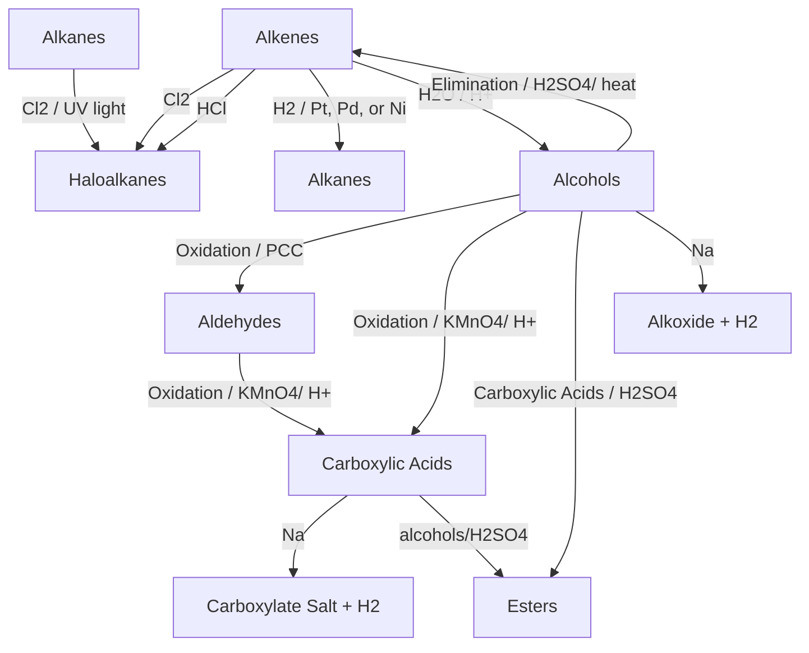
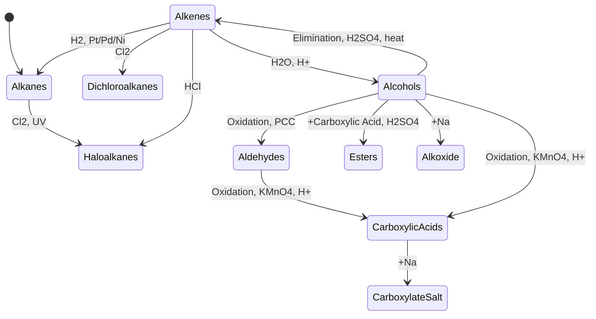
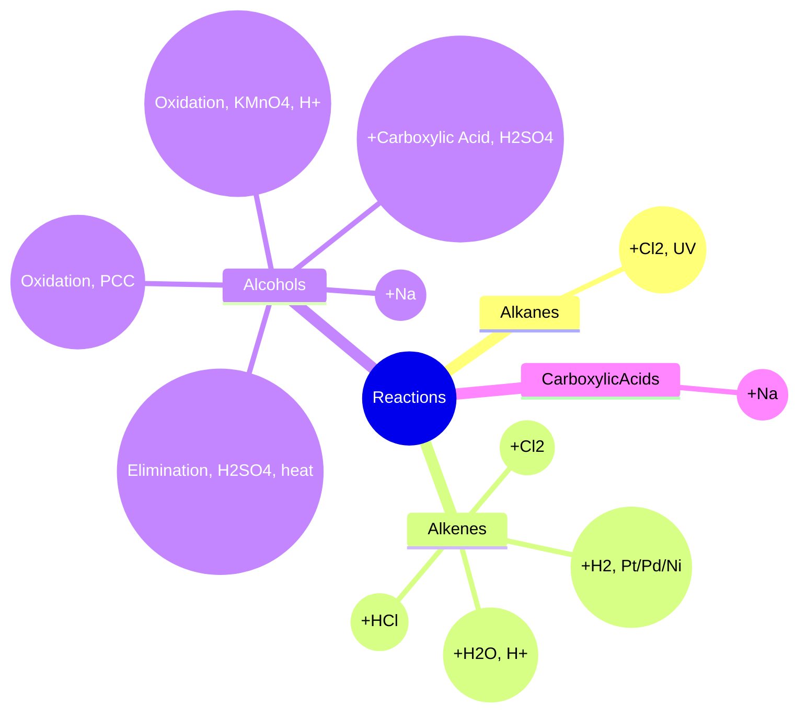

```mermaid
graph TD;
    %% Alkanes
        A[Alkanes] -->|Cl2 / UV light| B[Haloalkanes];

            %% Alkenes
                C[Alkenes] -->|Cl2| D[Dichloroalkanes];
                    C -->|HCl| E[Haloalkanes];
                        C -->|H2 / Pt, Pd, or Ni| F[Alkanes];
                            C -->|H2O / H+| G[Alcohols];

                                %% Alcohols
                                    G -->|Elimination / H2SO4, heat| C;
                                        G -->|Oxidation / PCC| H[Aldehydes];
                                            H -->|Oxidation / KMnO4, H+| I[Carboxylic Acids];
                                                G -->|Oxidation / KMnO4, H+| I;
                                                    G -->|+ Carboxylic Acids / H2SO4| J[Esters];
                                                        G -->|+ Na| K[Alkoxide + H2];
                                                            I -->|+ Na| L[Carboxylate Salt + H2];

                                                                %% Alkynes
                                                                    M[Alkynes] -->|H2 / Lindlar| C; %% Alkyne to Alkene (Lindlar catalyst)
                                                                        M -->|H2 / Pt, Pd, or Ni| F; %% Alkyne to Alkane
                                                                            M -->|Cl2| N[Haloalkenes or Haloalkanes];
                                                                                M -->|HBr (1 equiv)| O[Haloalkenes];
                                                                                    M -->|HBr (excess)| P[Haloalkanes];
                                                                                        M -->|H2O / H2SO4, Hg2+| H; %% Alkyne hydration to Aldehyde

                                                                                            %% Haloalkanes
                                                                                                B -->|+ NaOH| G; %% Haloalkane to Alcohol
                                                                                                    G -->|+ HCl| B; %% Alcohol to Haloalkane

                                                                                                        %% Aldehydes
                                                                                                            H -->|Reduction / H2, Pt| G; %% Aldehyde to Alcohol
                                                                                                            

```

