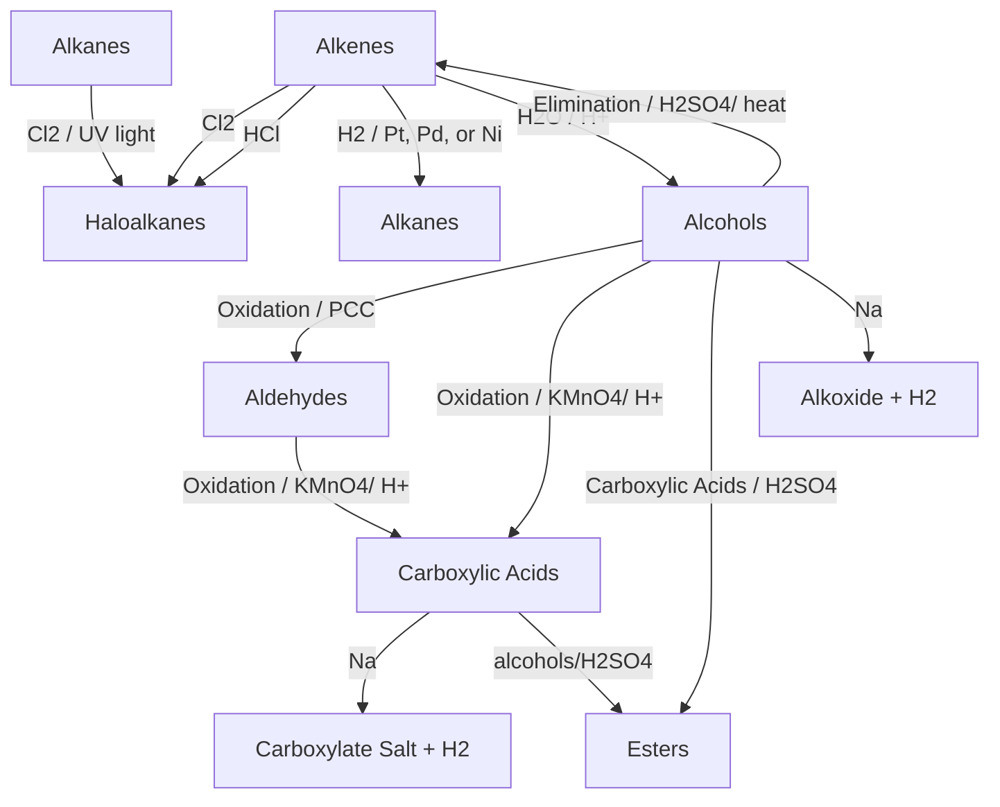
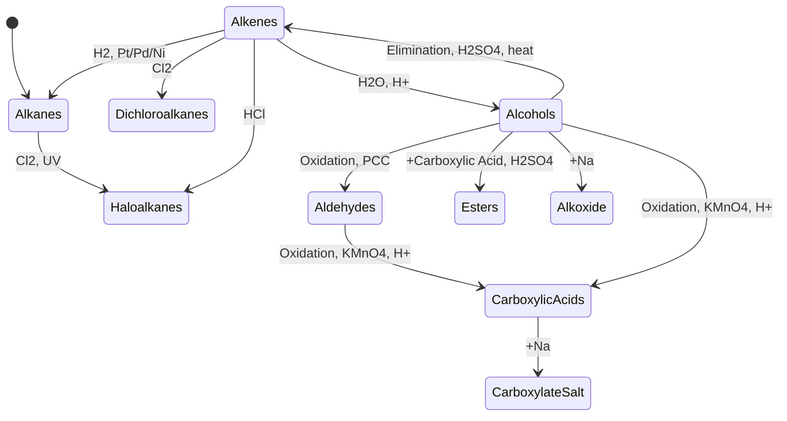
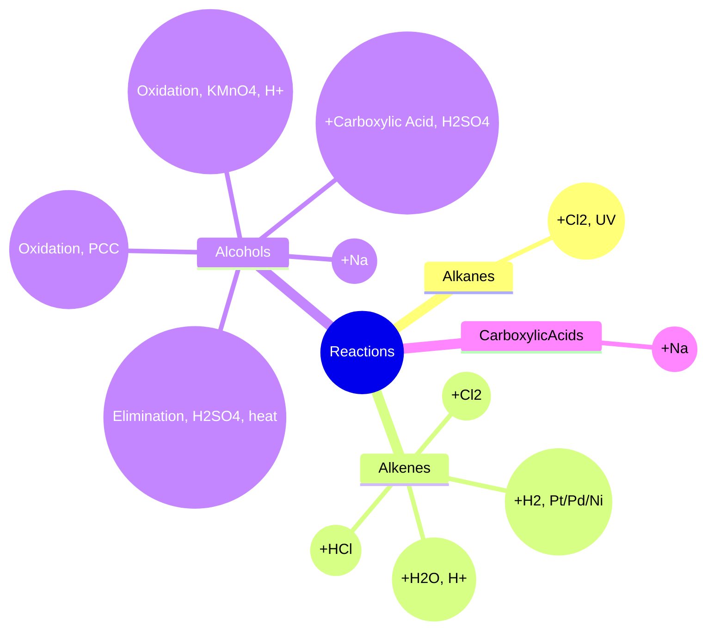

```mermaid
graph TD;
    %% Group 1: Alkanes
    subgraph "Alkanes & Haloalkanes" 
      A[Alkanes] -->|Cl2 / UV light| B[Haloalkanes];
      B -->|+ NaOH| G[Alcohols];
      G -->|+ HCl| B; 
    end

    %% Group 2: Alkenes
    subgraph "Alkenes & Their Reactions"
      C[Alkenes] -->|Cl2| D[Dichloroalkanes];
      C -->|HCl| E[Haloalkanes];
      C -->|H2 / Pt, Pd, or Ni| F[Alkanes];
      C -->|H2O / H+| G[Alcohols];
      G -->|Elimination / H2SO4, heat| C;
    end

    %% Group 3: Alkynes
    subgraph "Alkynes & Their Reactions"
      M[Alkynes] -->|H2 / Lindlar| C;
      M -->|H2 / Pt, Pd, or Ni| F;
      M -->|Cl2| N[Haloalkenes or Haloalkanes];
      M -->|HBr 1eq | O[Haloalkenes];
      M -->|HBrgraph TD;
    %% Group 1: Alkanes
    subgraph "Alkanes & Haloalkanes" 
      A[Alkanes] -->|Cl2 / UV light| B[Haloalkanes];
      B -->|+ NaOH| G[Alcohols];
      G -->|+ HCl| B; 
    end

    %% Group 2: Alkenes
    subgraph "Alkenes & Their Reactions"
      C[Alkenes] -->|Cl2| D[Dichloroalkanes];
      C -->|HCl| E[Haloalkanes];
      C -->|H2 / Pt, Pd, or Ni| F[Alkanes];
      C -->|H2O / H+| G[Alcohols];
      G -->|Elimination / H2SO4, heat| C;
    end

    %% Group 3: Alkynes
    subgraph "Alkynes & Their Reactions"
      M[Alkynes] -->|H2 / Lindlar| C;
      M -->|H2 / Pt, Pd, or Ni| F;
      M -->|Cl2| N[Haloalkenes or Haloalkanes];
      M -->|HBr (1 equiv)| O[Haloalkenes];
      M -->|HBr (excess)| P[Haloalkanes];
      M -->|H2O / H2SO4, Hg2+| H[Aldehydes];
    end

    %% Group 4: Alcohols & Their Transformations
    subgraph "Alcohol Transformations"
      G -->|Oxidation / PCC| H;
      H -->|Oxidation / KMnO4, H+| I[Carboxylic Acids];
      G -->|Oxidation / KMnO4, H+| I;
      G -->|+ Carboxylic Acids / H2SO4| J[Esters];
      G -->|+ Na| K[Alkoxide + H2];
    end

    %% Group 5: Aldehydes & Carboxylic Acids
    subgraph "Aldehydes & Carboxylic Acids"
      I -->|+ Na| L[Carboxylate Salt + H2];
      H -->|Reduction / H2, Pt| G;
    end

    %% Styling
    classDef alkanes fill:#FFDDC1,stroke:#FF5733,stroke-width:2px;
    classDef alkenes fill:#D4E157,stroke:#33691E,stroke-width:2px;
    classDef alkynes fill:#FFAB91,stroke:#BF360C,stroke-width:2px;
    classDef alcohols fill:#81D4FA,stroke:#01579B,stroke-width:2px;
    classDef aldehydes fill:#FFCC80,stroke:#FF6F00,stroke-width:2px;
    classDef carboxylic fill:#A5D6A7,stroke:#1B5E20,stroke-width:2px;

    class A,B alkanes;
    class C,D,E,F alkenes;
    class M,N,O,P alkynes;
    class G,J,K alcohols;
    class H aldehydes;
    class I,L carboxylic;graph TD;
    %% Group 1: Alkanes
    subgraph "Alkanes & Haloalkanes" 
      A[Alkanes] -->|Cl2 / UV light| B[Haloalkanes];
      B -->|+ NaOH| G[Alcohols];
      G -->|+ HCl| B; 
    end

    %% Group 2: Alkenes
    subgraph "Alkenes & Their Reactions"
      C[Alkenes] -->|Cl2| D[Dichloroalkanes];
      C -->|HCl| E[Haloalkanes];
      C -->|H2 / Pt, Pd, or Ni| F[Alkanes];
      C -->|H2O / H+| G[Alcohols];
      G -->|Elimination / H2SO4, heat| C;
    end

    %% Group 3: Alkynes
    subgraph "Alkynes & Their Reactions"
      M[Alkynes] -->|H2 / Lindlar| C;
      M -->|H2 / Pt, Pd, or Ni| F;
      M -->|Cl2| N[Haloalkenes or Haloalkanes];
      M -->|HBr (1 equiv)| O[Haloalkenes];
      M -->|HBr (excess)| P[Haloalkanes];
      M -->|H2O / H2SO4, Hg2+| H[Aldehydes];
    end

    %% Group 4: Alcohols & Their Transformations
    subgraph "Alcohol Transformations"
      G -->|Oxidation / PCC| H;
      H -->|Oxidation / KMnO4, H+| I[Carboxylic Acids];
      G -->|Oxidation / KMnO4, H+| I;
      G -->|+ Carboxylic Acids / H2SO4| J[Esters];
      G -->|+ Na| K[Alkoxide + H2];
    end

    %% Group 5: Aldehydes & Carboxylic Acids
    subgraph "Aldehydes & Carboxylic Acids"
      I -->|+ Na| L[Carboxylate Salt + H2];
      H -->|Reduction / H2, Pt| G;
    end

    %% Styling
    classDef alkanes fill:#FFDDC1,stroke:#FF5733,stroke-width:2px;
    classDef alkenes fill:#D4E157,stroke:#33691E,stroke-width:2px;
    classDef alkynes fill:#FFAB91,stroke:#BF360C,stroke-width:2px;
    classDef alcohols fill:#81D4FA,stroke:#01579B,stroke-width:2px;
    classDef aldehydes fill:#FFCC80,stroke:#FF6F00,stroke-width:2px;
    classDef carboxylic fill:#A5D6A7,stroke:#1B5E20,stroke-width:2px;

    class A,B alkanes;
    class C,D,E,F alkenes;
    class M,N,O,P alkynes;
    class G,J,K alcohols;
    class H aldehydes;
    class I,L carboxylic;| P[Haloalkanes];
      M -->|H2O / H2SO4, Hg2+| H[Aldehydes];
    end

    %% Group 4: Alcohols & Their Transformations
    subgraph "Alcohol Transformations"
      G -->|Oxidation / PCC| H;
      H -->|Oxidation / KMnO4, H+| I[Carboxylic Acids];
      G -->|Oxidation / KMnO4, H+| I;
      G -->|+ Carboxylic Acids / H2SO4| J[Esters];
      G -->|+ Na| K[Alkoxide + H2];
    end

    %% Group 5: Aldehydes & Carboxylic Acids
    subgraph "Aldehydes & Carboxylic Acids"
      I -->|+ Na| L[Carboxylate Salt + H2];
      H -->|Reduction / H2, Pt| G;
    end

    %% Styling
    classDef alkanes fill:#FFDDC1,stroke:#FF5733,stroke-width:2px;
    classDef alkenes fill:#D4E157,stroke:#33691E,stroke-width:2px;
    classDef alkynes fill:#FFAB91,stroke:#BF360C,stroke-width:2px;
    classDef alcohols fill:#81D4FA,stroke:#01579B,stroke-width:2px;
    classDef aldehydes fill:#FFCC80,stroke:#FF6F00,stroke-width:2px;
    classDef carboxylic fill:#A5D6A7,stroke:#1B5E20,stroke-width:2px;

    class A,B alkanes;
    class C,D,E,F alkenes;
    class M,N,O,P alkynes;
    class G,J,K alcohols;
    class H aldehydes;
    class I,L carboxylic;graph TD;
    %% Group 1: Alkanes
    subgraph "Alkanes & Haloalkanes" 
      A[Alkanes] -->|Cl2 / UV light| B[Haloalkanes];
      B -->|+ NaOH| G[Alcohols];
      G -->|+ HCl| B; 
    end

    %% Group 2: Alkenes
    subgraph "Alkenes & Their Reactions"
      C[Alkenes] -->|Cl2| D[Dichloroalkanes];
      C -->|HCl| E[Haloalkanes];
      C -->|H2 / Pt, Pd, or Ni| F[Alkanes];
      C -->|H2O / H+| G[Alcohols];
      G -->|Elimination / H2SO4, heat| C;
    end

    %% Group 3: Alkynes
    subgraph "Alkynes & Their Reactions"
      M[Alkynes] -->|H2 / Lindlar| C;
      M -->|H2 / Pt, Pd, or Ni| F;
      M -->|Cl2| N[Haloalkenes or Haloalkanes];
      M -->|HBr (1 equiv)| O[Haloalkenes];
      M -->|HBr (excess)| P[Haloalkanes];
      M -->|H2O / H2SO4, Hg2+| H[Aldehydes];
    end

    %% Group 4: Alcohols & Their Transformations
    subgraph "Alcohol Transformations"
      G -->|Oxidation / PCC| H;
      H -->|Oxidation / KMnO4, H+| I[Carboxylic Acids];
      G -->|Oxidation / KMnO4, H+| I;
      G -->|+ Carboxylic Acids / H2SO4| J[Esters];
      G -->|+ Na| K[Alkoxide + H2];
    end

    %% Group 5: Aldehydes & Carboxylic Acids
    subgraph "Aldehydes & Carboxylic Acids"
      I -->|+ Na| L[Carboxylate Salt + H2];
      H -->|Reduction / H2, Pt| G;
    end

    %% Styling
    classDef alkanes fill:#FFDDC1,stroke:#FF5733,stroke-width:2px;
    classDef alkenes fill:#D4E157,stroke:#33691E,stroke-width:2px;
    classDef alkynes fill:#FFAB91,stroke:#BF360C,stroke-width:2px;
    classDef alcohols fill:#81D4FA,stroke:#01579B,stroke-width:2px;
    classDef aldehydes fill:#FFCC80,stroke:#FF6F00,stroke-width:2px;
    classDef carboxylic fill:#A5D6A7,stroke:#1B5E20,stroke-width:2px;

    class A,B alkanes;
    class C,D,E,F alkenes;
    class M,N,O,P alkynes;
    class G,J,K alcohols;
    class H aldehydes;
    class I,L carboxylic;

```

